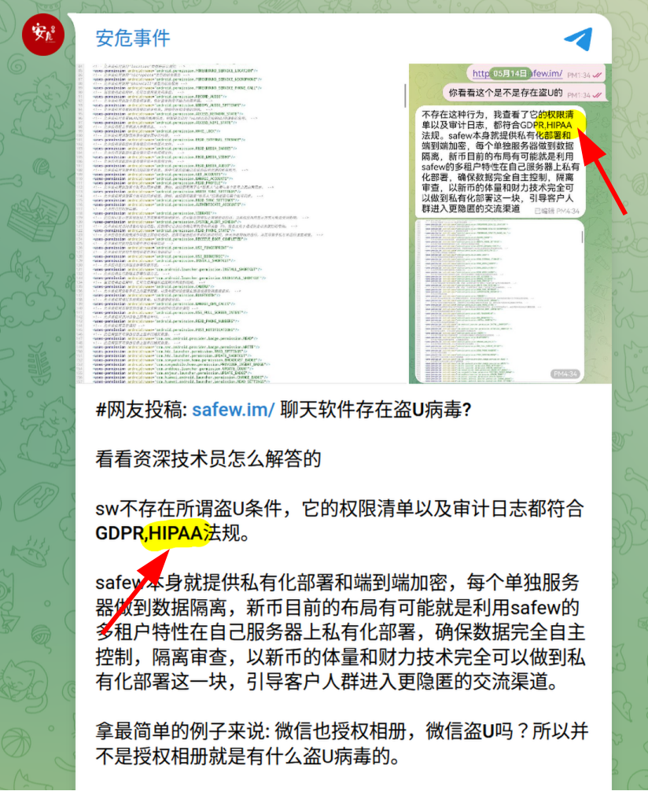
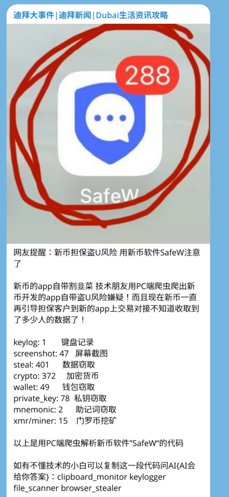

# SafeW / SafeX Brand and Domains

本仓库记录 SafeW / SafeX 相关名称、包名、公开分发线索、搜索矩阵截图与洗白话术。

它的用途不是重复证明恶意代码本身，而是解释为什么普通中文用户搜索“SafeW 安全吗”时容易被推广站、矩阵站和软文误导。

## 仓库文件

| 文件 | 内容 |
| --- | --- |
| `package-names.md` | SafeW / SafeX 包名与名称关系 |
| `domains.md` | 站点页面记录的相近域名与搜索矩阵 |
| `search-matrix.md` | 搜索结果被宣传矩阵污染的说明 |
| `wash-claims.md` | 常见洗白话术与反驳 |
| `screenshots/README.md` | 截图说明 |
| `hashes.md` | 截图 SHA256 |

## 关键截图

### 搜索矩阵截图

### HIPAA 洗白话术截图

### Keylog / keylogger 相关截图

## 相关证据

技术证据、包名、Kaspersky 与 The Hacker News 来源见：

- https://nosafew.com/evidence/

