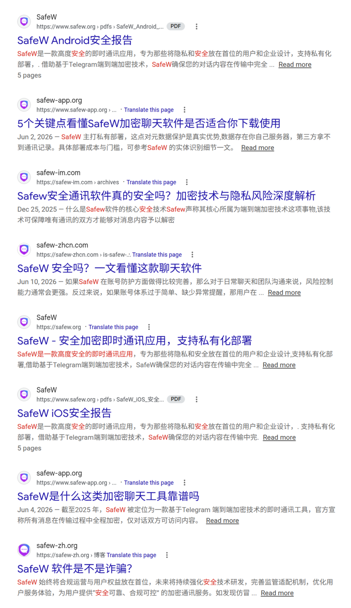

# Search Matrix

当中文用户搜索“SafeW 安全吗”“SafeW 是否安全”“SafeW Messenger”等关键词时，容易看到大量看似中立、实际高度同质化的“安全报告”和“深度解析”页面。

NoSafeW 站点把这种现象称为“宣传矩阵”或“搜索污染”。

## 观察到的模式

- 多个相近域名同时围绕 SafeW 安全性发文。
- 标题常见“SafeW 是否安全”“SafeW 加密技术解析”“SafeW 安全报告”等。
- 内容常把“申请相册权限很正常”“用户下载错了”“符合某某合规”作为重点。
- 很少正面回应 Kaspersky 报告中被点名的包名 / Bundle ID。
- 对非技术用户来说，这些页面容易造成“网上都说安全”的错觉。

## 截图

## 应对方式

不要用低质量矩阵站反打矩阵站。更稳的方式是：

- 维护一个清晰的证据仓库。
- 维护一个时间线仓库。
- 维护一个面向普通用户的自救指南。
- 在博客、论坛、Telegram、X 等平台发布少量高质量内容，指向证据页。

这样更像公共安全资料，而不是 spam。
